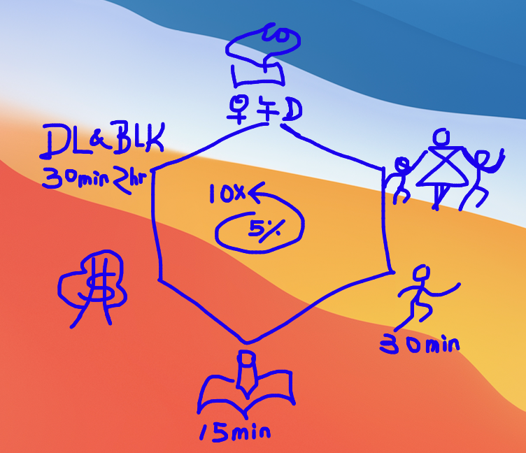

Hello and welcome to Paul JL Wu's vblog!

## What I plan to write here
- baby steps and milestones on what I learn of the day 
- quarterly review and preview

## Objectives: upgrade 5% weekly, 10X in 2022 
- Relationship: Leave happiness and inspiration to my wife and kids on each & every interaction
- Investment: profit consistently in stock, cryto and REI
- Learning: read and write daily (15 min, 60 min) and publish weekly
- Expertise: practice DL and Blockchain and understand principles
- Playing: MMA, free runing, swimming (30 min, 90 min)
- Core: closed walk & talk with Him ( 15 + 15 + 15)
